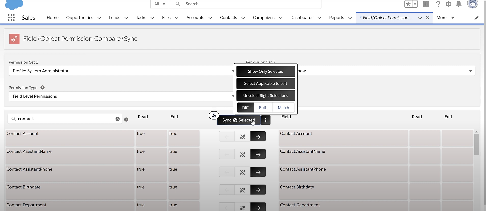

# Salesforce Field level (FLS) & Object level - permissions compare & sync 

A free tool for Salesforce Admins by Asprire Bright LLC

[](https://youtu.be/AJLJWqwA5Vw)

## For installing this App on your Salesforce Org, please follow the below instructions.

Make sure to start from a brand-new salesforce project on vs code environment to avoid conflicts with previous work you may have done.

1. Clone this repository:

    ```
    git clone https://github.com/aspirebright/field-object-permission-compare-sync.git
    cd field-object-permission-compare-sync
    ```

1. Authorize your Trailhead Playground or Developer org and provide it with an alias (**mydevorg** in the command below):

    ```
    sfdx force:auth:web:login -s -a mydevorg
    ```

1. If you are setting up a Developer Edition: go to **Setup**, under **My Domain**, [register a My Domain](https://help.salesforce.com/articleView?id=domain_name_setup.htm&type=5).

1. Run this command in a terminal to deploy the app.

    ```
    sfdx force:source:deploy -p force-app
    ```

1. After successful deployment, activate the App page - Field/Object Permission Compare/Sync for System Admins Only on the deployed Org.
